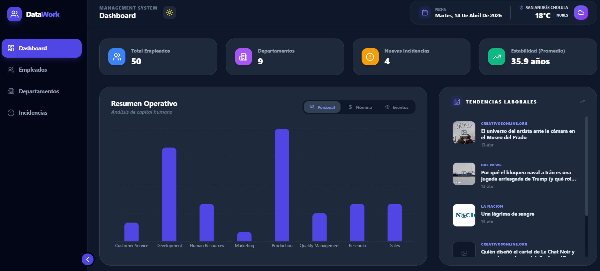
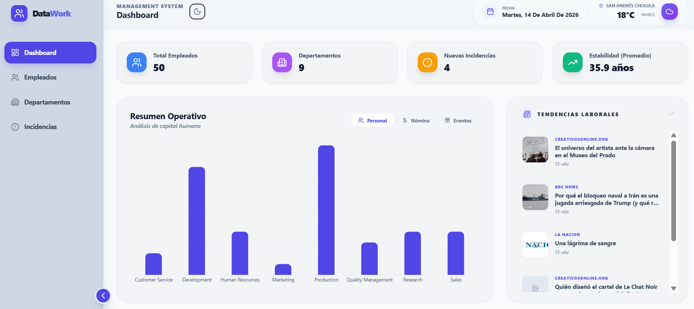
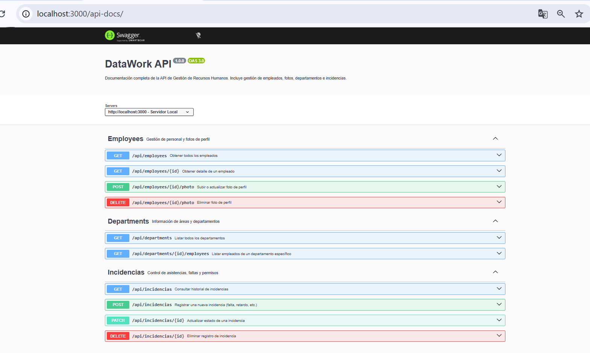

# 📊 DataWork - HR Management System

De acuerdo al proyecto propuesto, DataWork es una plataforma para la gestión de Recursos Humanos, diseñada para visualizar empleados, departamentos e incidencias. El sistema incluye un **Dashboard interactivo** y soporte completo para **Dark Mode**.

## ✨ Características Principales

* **Gestión de Empleados:** Visualización de perfiles detallados con historial de puestos y salarios.
* **Filtros Inteligentes:** Buscador dinámico y filtrado por departamentos.
* **Control de Incidencias:** Registro y gestión de faltas, retardos y permisos con actualización de estatus.
* **Dark Mode Nativo:** Persistencia de preferencia de tema mediante `localStorage`.
* **Diseño Responsive:** Interfaz moderna construida con Tailwind CSS.

## 🛠️ Stack Tecnológico

**Frontend:**
* React.js + Vite
* Tailwind CSS (Estilos y Dark Mode)
* Lucide React (Iconografía)
* Recharts (Estadísticas del Dashboard)

**Backend:**
* Node.js + Express
* MySQL (Base de Datos)
* Multer (Gestión de imágenes de perfil)

## 📸 Demo Visual

> 
> 

### 1. Requisitos previos
* Node.js instalado.
* MySQL Server corriendo localmente con la DB proporcionada ./Backend/DB/ DB_Employees_V1.zip
* APIkey de OpenWeather
* APIkey de NewsAPI

## 2. Configuración del Frontend
cd frontend
npm install
npm run dev

### 3. Configuración del Backend
cd backend
npm install
node index.js

## 📖 Documentación de la API (Swagger)

El proyecto cuenta con documentación interactiva.
Para explorar y probar los endpoints:

1. Inicia el servidor backend (`node index.js`).
2. Ve a 🔗 [http://localhost:3000/api-docs](http://localhost:3000/api-docs)
3. Utiliza el botón **"Try it out"** para ejecutar peticiones reales a la base de datos.

> 

💻👾Desarrollado por JUAN ERNESTO VEGA NANNI - 2026